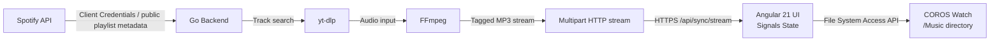

# AGENT.md — CorosMusic

> **Spotify → COROS watch sync tool.** Go backend for Spotify metadata + audio pipeline, Angular 21 frontend for UI and writing/removing files on the watch.
> **Shell**: use `bash` as a prefix for commands. Unless a file in the repo explicitly requires something else.

---

## System Architecture



---

## Project Structure

```text
coros_music/
├── AGENT.md
├── README.md
├── Dockerfile
├── docker-compose.yml
├── coros-data/                    # Local persisted TLS certs during dev (cert.pem/key.pem)
├── server/
│   ├── cmd/
│   │   └── coros-music/
│   │       └── main.go            # HTTPS server, static serving, self-signed cert generation
│   ├── internal/
│   │   ├── httpx/
│   │   │   └── content_disposition.go
│   │   ├── pipeline/
│   │   │   ├── resolver.go        # yt-dlp-assisted media resolution
│   │   │   ├── transcoder.go      # FFmpeg MP3 transcoding pipeline
│   │   │   └── tagger.go          # MP3 tagging
│   │   ├── spotify/
│   │   │   ├── auth.go            # Spotify client-credentials access to public playlists
│   │   │   └── playlists.go       # Filesystem-safe sync filename generation
│   │   ├── stream/
│   │   │   └── chunked.go         # multipart/mixed streaming writer
│   │   └── sync/
│   │       └── coordinator.go     # Worker pool + ordered multipart write-out
│   ├── go.mod
│   └── go.sum
└── front_end/
    ├── angular.json
    ├── package.json
    ├── proxy.conf.json            # Proxies /api to https://localhost:8080 with secure=false
    ├── tsconfig.json
    ├── tsconfig.app.json
    ├── tsconfig.spec.json
    ├── public/
    │   └── favicon.ico
    └── src/
        ├── index.html
        ├── main.ts
        ├── styles.css
        └── app/
            ├── app.ts
            ├── app.routes.ts
            ├── app.config.ts
            ├── core/
            │   ├── models/
            │   │   ├── playlist.model.ts
            │   │   └── track.model.ts
            │   ├── services/
            │   │   ├── file-bridge.service.ts   # Connect watch, scan files, remove files, write files
            │   │   ├── spotify.service.ts       # Playlist URL/ID workflows
            │   │   ├── sync.service.ts          # Sync target resolution + multipart parser
            │   │   └── watch-health.service.ts
            │   ├── state/
            │   │   └── sync.state.ts            # Angular signals for playlists/watch/sync state
            │   └── utils/
            │       ├── content-disposition.util.ts
            │       ├── content-disposition.util.spec.ts
            │       ├── watch-filename.util.ts
            │       └── watch-filename.util.spec.ts
            └── features/
                ├── dashboard/
                │   ├── dashboard.component.ts
                │   └── dashboard.component.html
                ├── playlist-picker/
                │   ├── playlist-picker.component.ts
                │   └── playlist-picker.component.html
                └── sync-progress/
                    ├── sync-progress.component.ts
                    └── sync-progress.component.html
```

---

## Backend Overview

### Spotify access model

The backend uses **Spotify Client Credentials** (`SPOTIFY_CLIENT_ID` + `SPOTIFY_CLIENT_SECRET`).

- No user Spotify login
- No redirect URI handling
- No refresh-token persistence
- Only **public** playlist access is supported

### HTTPS behavior

The Go server runs over **HTTPS**, not plain HTTP.

- On startup, `server/cmd/coros-music/main.go` ensures `cert.pem` + `key.pem` exist
- If missing or invalid, it generates self-signed certs automatically
- Certs are persisted under `COROS_DATA_DIR` when set
- Fallback data dir behavior:
  - `COROS_DATA_DIR` if provided
  - `/root/.coros-music` in Docker if present
  - `coros-data` locally otherwise

### Key backend packages

| Package | Purpose |
|---|---|
| `internal/spotify` | Spotify metadata access and track filename generation |
| `internal/pipeline` | yt-dlp + FFmpeg resolution, transcoding, tagging |
| `internal/sync` | Worker pool, ordered job processing, request handling |
| `internal/stream` | Multipart chunked response writer |
| `internal/httpx` | `Content-Disposition` formatting helpers |

### Sync concurrency model

- Worker count defaults to `4` and can be overridden by `COROS_WORKERS`
- Each selected track is transcoded in its own goroutine
- Results are buffered and written back to the client **in original order**
- Request `context.Context` is propagated so disconnect/cancel stops work

---

## API Endpoints

| Method | Path | Description |
|---|---|---|
| `GET` | `/api/spotify/status` | Returns backend Spotify availability (`{"authenticated":true}` in current implementation) |
| `GET` | `/api/spotify/playlists?userId=X` | Returns public playlists for a user; without `userId` it returns `[]` |
| `GET` | `/api/spotify/playlists/{id}` | Returns playlist metadata for a public playlist |
| `GET` | `/api/spotify/playlists/{id}/tracks` | Returns normalized track metadata including `syncFilename` |
| `POST` | `/api/sync/stream` | Streams selected MP3s as `multipart/mixed` |
| `GET` | `/api/health` | Returns JSON health for `ffmpeg`, `yt-dlp`, and Spotify backend availability |

### `/api/sync/stream` request body

```json
{
  "playlistId": "spotify-playlist-id",
  "playlistName": "Playlist name",
  "trackIds": ["track-id-1", "track-id-2"],
  "existingFiles": ["Artist - Title.mp3"],
  "tracks": [
    {
      "id": "track-id-1",
      "title": "Song Title",
      "artist": "Artist",
      "album": "Album",
      "syncFilename": "Artist - Song Title.mp3"
    }
  ]
}
```

### `/api/sync/stream` response format

```http
HTTP/1.1 200 OK
Content-Type: multipart/mixed; boundary=corospart
Transfer-Encoding: chunked

--corospart
Content-Disposition: attachment; filename="Artist - Song Title.mp3"
X-Track-Index: 1
X-Track-Total: 2

<raw MP3 bytes>
--corospart
Content-Disposition: attachment; filename="Artist - Another Song.mp3"
X-Track-Index: 2
X-Track-Total: 2
X-Track-Error: transcode failed

--corospart--
```

Notes:

- Successful parts contain MP3 bytes
- Failed parts may include `X-Track-Error`
- The frontend parses this stream and writes successful tracks to the watch

---

## Frontend Overview

### Playlist workflow

The Angular app does **not** authenticate the Spotify user.

Current UX:

1. User pastes a Spotify playlist URL or playlist ID
2. Frontend extracts the playlist ID
3. Backend loads metadata/tracks for that public playlist
4. Playlist is stored locally in frontend state/localStorage

### State model

Important signals in `front_end/src/app/core/state/sync.state.ts`:

- `playlists`
- `selectedPlaylist`
- `syncPlaylist`  ← can differ from current viewed playlist
- `tracks`
- `existingFiles`
- `syncStatus`
- `progress`
- `tracksToSync`
- `tracksSynced`

`selectedPlaylist` controls what is currently shown in the UI.

`syncPlaylist` controls what the sync action targets.

### Watch integration

`FileBridgeService` is responsible for:

- prompting for a directory using the File System Access API
- verifying that `/Music` exists
- scanning current `.mp3` files on the watch
- writing synced MP3 files
- removing selected files from the watch

### Current sync UX

The `sync-progress` feature currently supports:

- syncing all pending tracks for the sync target
- syncing only selected tracks
- cancelling an in-flight sync
- listing songs already on the watch
- removing individual or selected songs from the watch

There is currently **no playlist ZIP download flow**.

---

## Filename & Delta-Sync Rules

### Current filename convention

New synced files are named like:

```text
Artist - Title.mp3
```

The raw Spotify track ID is **not** included in new filenames.

### Legacy compatibility

Older files may still look like:

```text
4NPeA5XXs6tjHrtanLYJxf — Artist - Title.mp3
```

The frontend normalizes these via `watch-filename.util.ts`, stripping the old prefix so both old and new filenames match the same track for sync purposes.

### Delta sync logic

High level flow:

1. Playlist tracks come from `/api/spotify/playlists/{id}/tracks`
2. Watch `/Music` files are scanned into `existingFiles`
3. Filenames are normalized on the frontend
4. `tracksToSync` and `tracksSynced` compare normalized watch filenames against each track's `syncFilename`
5. `SyncService` sends only missing tracks to `/api/sync/stream`
6. After sync, watch files are scanned again

Important implication:

- same **title** with different **artists** is fine
- collision risk exists only if multiple tracks resolve to the exact same sanitized `Artist - Title.mp3`

---

## Environment Variables

| Variable | Default | Description |
|---|---|---|
| `COROS_PORT` | `8080` | HTTPS listen port |
| `COROS_DATA_DIR` | auto | Directory for persisted TLS certs/data |
| `SPOTIFY_CLIENT_ID` | — | Spotify app client ID |
| `SPOTIFY_CLIENT_SECRET` | — | Spotify app client secret |
| `COROS_WORKERS` | `4` | Concurrent transcode workers |
| `COROS_FFMPEG_PATH` | `ffmpeg` | Path to FFmpeg binary |
| `COROS_YTDLP_PATH` | `yt-dlp` | Path to yt-dlp binary |
| `COROS_AUDIO_ENCODER` | auto | Optional FFmpeg encoder override |
| `COROS_STATIC_DIR` | unset | Directory to serve built frontend from |

---

## Development & Build

### Prerequisites

- Go 1.23+
- Node.js 22+
- Angular CLI 21.x
- FFmpeg
- yt-dlp

### Local development

```bash
# backend
cd /home/victor/me/coros_music/server
go run ./cmd/coros-music

# frontend
cd /home/victor/me/coros_music/front_end
npm install
npx ng serve --proxy-config proxy.conf.json
```

Notes:

- frontend proxy target is `https://localhost:8080`
- proxy uses `"secure": false` because the backend cert is self-signed

### Docker

```bash
cd /home/victor/me/coros_music
docker compose up --build
```

---

## Coding Conventions

- **Go**: standard library style, `internal/` for non-exported packages, wrap errors with context where useful
- **Angular**: standalone components, signals-first state, `inject()` for DI, dedicated `.html` templates
- **Frontend state**: keep displayed playlist (`selectedPlaylist`) distinct from actual sync target (`syncPlaylist`)
- **Tailwind**: utility-first styling in `front_end/src/styles.css`
- **Tests**:
  - Go: table-driven tests where practical
  - Frontend: Vitest-style specs in `src/app/core/utils/*.spec.ts`

## Things likely to be stale first

If behavior changes, re-check these areas before trusting this document:

- endpoint list in `server/cmd/coros-music/main.go`
- sync filename logic in `server/internal/spotify/playlists.go`
- frontend matching rules in `front_end/src/app/core/state/sync.state.ts`
- sync target behavior in `front_end/src/app/core/services/sync.service.ts`
- watch management UI in `front_end/src/app/features/sync-progress/`
