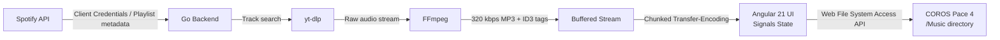

# AGENT.md — CorosMusic

> **Spotify → COROS Pace 4 Watch** sync tool. Go backend for audio pipeline, Angular 21 frontend for UI & hardware writes.
> **Note**: All CLI tools run by this agent should be executed in the `fish` shell.

---

## System Architecture



---

## Project Structure

```
coros_music/
├── AGENT.md
├── README.md
├── Dockerfile
├── docker-compose.yml
├── .env                          # SPOTIFY_CLIENT_ID, SPOTIFY_CLIENT_SECRET
├── server/                       # Go backend
│   ├── cmd/
│   │   └── coros-music/
│   │       └── main.go           # Entrypoint, HTTP server (plain HTTP)
│   ├── internal/
│   │   ├── spotify/
│   │   │   ├── auth.go           # Client Credentials flow via zmb3/spotify/v2
│   │   │   └── playlists.go      # Filename sanitization
│   │   ├── pipeline/
│   │   │   ├── resolver.go       # yt-dlp search via exec.Command
│   │   │   ├── transcoder.go     # FFmpeg 320 kbps pipe
│   │   │   └── tagger.go         # ID3 tagging via FFmpeg metadata
│   │   ├── stream/
│   │   │   └── chunked.go        # Multipart HTTP response writer
│   │   └── sync/
│   │       └── coordinator.go    # Goroutine pool, job channels
│   ├── go.mod
│   └── go.sum
└── front_end/                    # Angular 21 frontend
    ├── angular.json
    ├── package.json
    ├── proxy.conf.json
    ├── tsconfig.json
    ├── tsconfig.app.json
    ├── tsconfig.spec.json
    ├── public/
    │   └── favicon.ico
    └── src/
        ├── index.html
        ├── main.ts
        ├── styles.css            # Tailwind v4 + COROS theme
        └── app/
            ├── app.ts
            ├── app.routes.ts
            ├── app.config.ts     # provideHttpClient, provideRouter
            ├── core/
            │   ├── models/
            │   │   ├── playlist.model.ts
            │   │   └── track.model.ts
            │   ├── state/
            │   │   └── sync.state.ts         # All Signals for app state
            │   └── services/
            │       ├── spotify.service.ts     # HTTP calls to /api/spotify/*
            │       ├── sync.service.ts        # Fetch + multipart stream parser
            │       ├── file-bridge.service.ts # Web File System Access API
            │       └── watch-health.service.ts
            └── features/
                ├── dashboard/
                │   ├── dashboard.component.ts
                │   └── dashboard.component.html
                ├── playlist-picker/
                │   ├── playlist-picker.component.ts
                │   └── playlist-picker.component.html
                └── sync-progress/
                    ├── sync-progress.component.ts
                    └── sync-progress.component.html
```

---

## Go Backend Specifications

### Spotify Auth: Client Credentials Flow

No user login, no redirect URI, no consent screen. The backend authenticates with `SPOTIFY_CLIENT_ID` + `SPOTIFY_CLIENT_SECRET` using the Client Credentials grant. This gives access to any **public** Spotify playlist.

### Key Libraries

| Dependency | Purpose |
|---|---|
| `github.com/zmb3/spotify/v2` | Spotify Web API client (Client Credentials, playlists, tracks) |
| `golang.org/x/oauth2` | OAuth2 client credentials transport |

Audio pipeline uses `exec.Command` to call `yt-dlp` and `ffmpeg` directly (no Go bindings).

### Concurrency Model

```
               ┌─── goroutine: resolve(track) ──► yt-dlp search
               │
Coordinator ───┼─── goroutine: resolve(track) ──► yt-dlp search
  (buffered    │
   chan Job)   └─── goroutine: resolve(track) ──► yt-dlp search
                        │
                        ▼
                  chan AudioResult
                        │
                  ┌─────┴─────┐
                  │ transcode  │  FFmpeg stdin→stdout pipe
                  │ + tag      │  FFmpeg metadata flags for ID3
                  └─────┬─────┘
                        │
                  Chunked HTTP Response
```

- **Worker pool**: Configurable concurrency (default `COROS_WORKERS=4`).
- **Backpressure**: Workers buffer to `bytes.Buffer`, then results are written in order.
- **Cancellation**: All goroutines accept `context.Context` from the HTTP request.

### API Endpoints

| Method | Path | Description |
|---|---|---|
| `GET` | `/api/spotify/status` | Returns `{"authenticated":true}` |
| `GET` | `/api/spotify/playlists?userId=X` | Returns public playlists for a user |
| `GET` | `/api/spotify/playlists/{id}` | Returns a single playlist metadata |
| `GET` | `/api/spotify/playlists/{id}/tracks` | Returns tracks `[{id, title, artist, album, durationMs, syncFilename}]` |
| `POST` | `/api/sync/stream` | Streams MP3s as multipart chunked response |
| `GET` | `/api/health` | Backend readiness (FFmpeg + yt-dlp binary check) |

#### `/api/sync/stream` Response Format

```
HTTP/1.1 200 OK
Content-Type: multipart/mixed; boundary=corospart
Transfer-Encoding: chunked

--corospart
Content-Disposition: attachment; filename="3kVUbTB8m6uw — Song Title.mp3"
X-Track-Index: 1
X-Track-Total: 12

<raw MP3 bytes>
--corospart
Content-Disposition: attachment; filename="7xGfFoTpQ2E — Another Song.mp3"
X-Track-Index: 2
X-Track-Total: 12

<raw MP3 bytes>
--corospart--
```

### Environment Variables

| Variable | Default | Description |
|---|---|---|
| `COROS_PORT` | `8080` | HTTP listen port |
| `SPOTIFY_CLIENT_ID` | — | Spotify app client ID |
| `SPOTIFY_CLIENT_SECRET` | — | Spotify app client secret |
| `COROS_WORKERS` | `4` | Concurrent download/transcode goroutines |
| `COROS_FFMPEG_PATH` | `ffmpeg` | Path to FFmpeg binary |
| `COROS_YTDLP_PATH` | `yt-dlp` | Path to yt-dlp binary |

---

## Angular 21 Frontend Specifications

### Playlist Input (No Login Required)

Users paste a Spotify playlist URL or ID directly. The frontend extracts the playlist ID and fetches metadata + tracks via the backend. No OAuth consent screen, no redirect URI.

### Signal-Based State (`sync.state.ts`)

```typescript
export const spotifyConnected = signal(false);
export const playlists        = signal<Playlist[]>([]);
export const selectedPlaylist = signal<Playlist | null>(null);
export const tracks           = signal<Track[]>([]);
export const totalTracks      = signal(0);
export const completedTracks  = signal(0);
export const currentTrackName = signal('');
export const syncStatus       = signal<'idle' | 'syncing' | 'done' | 'error'>('idle');
export const syncError        = signal('');
export const watchDirHandle   = signal<FileSystemDirectoryHandle | null>(null);
export const watchConnected   = computed(() => watchDirHandle() !== null);
export const existingFiles    = signal<string[]>([]);
export const progress         = computed(() => /* percentage */);
export const tracksToSync     = computed(() => /* delta by track ID prefix */);
export const tracksSynced     = computed(() => /* already on watch */);
```

### UI / UX — COROS Sport-Mode Dashboard

Built with **Tailwind CSS v4+**, standalone components, COROS-inspired dark theme with red-orange brand accent.

- **Header**: Logo + Watch connect button (COROS red-orange accent)
- **Sidebar**: Playlist URL input + playlist list with album art
- **Main area**: Track list with sync status, progress bar, sync button
- **Footer**: Compact status bar (watch, file count, API health)
- **Empty states**: SVG icons, helpful prompts

### Delta Sync Algorithm

```
1. User pastes playlist URL → frontend extracts ID, fetches tracks via /api/spotify/playlists/:id/tracks
2. FileBridge scans watch /Music → existingFiles signal populated
3. tracksToSync = computed(tracks NOT in existingFiles)  // by Spotify track ID prefix in filename
4. UI shows synced tracks as checked/greyed
5. POST /api/sync/stream sends only delta trackIds
6. Backend resolves & streams only missing tracks
7. After sync, FileBridge re-scans watch
```

**Filename convention**: `{SpotifyTrackID} — {Artist} - {Title}.mp3`

---

## Development & Build

### Prerequisites

- Go 1.23+
- Node.js 22+
- Angular CLI 21.x
- FFmpeg (system)
- yt-dlp (system)

### Run Locally

```bash
# Backend
cd server && go run ./cmd/coros-music

# Frontend (separate terminal)
cd front_end && npm install && npx ng serve --proxy-config proxy.conf.json
```

### Docker

```bash
docker compose up --build
```

The `Dockerfile` builds Go backend, Angular frontend, and bundles with ffmpeg + yt-dlp in an Alpine runtime image.

---

## Coding Conventions

- **Go**: Standard library style. `internal/` for non-exported packages. Errors wrapped with `fmt.Errorf("context: %w", err)`.
- **Angular**: Standalone components only. No `NgModule`. Signals over RxJS where possible. Inject via `inject()` function. Separate `.html` template files.
- **CSS**: Tailwind v4+ utility-first. Custom COROS theme tokens in `front_end/src/styles.css` via `@theme`.
- **Filenames**: kebab-case everywhere. Go files: `snake_case.go`.
- **Tests**: Go table-driven tests. Angular uses Vitest (per `angular.json`).

